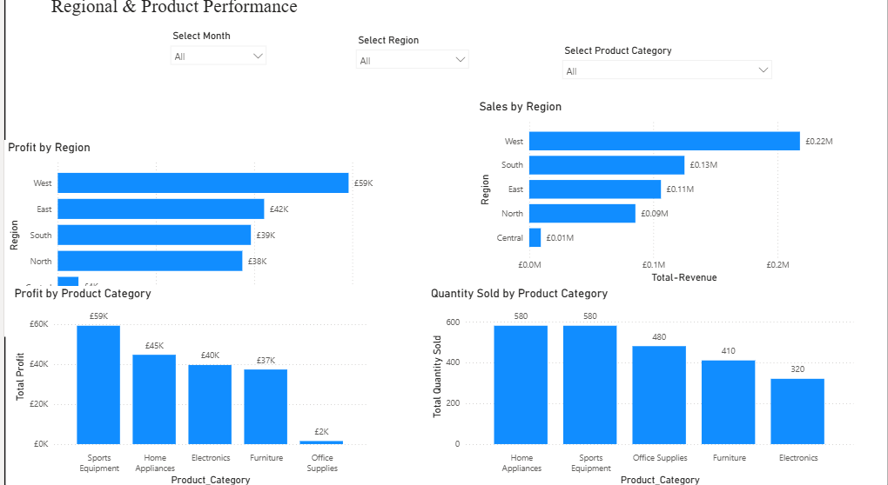
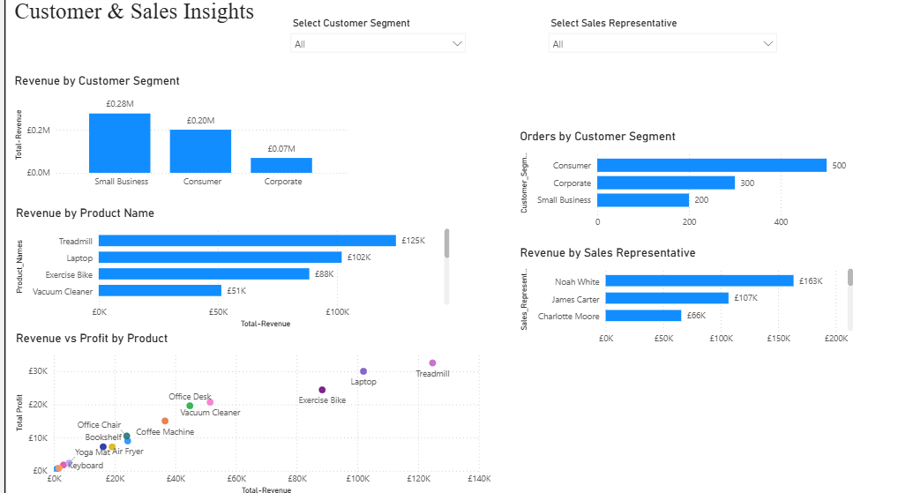

# Sales & Business Performance Dashboard

## Project Overview

This project presents an interactive Power BI dashboard developed to analyse business performance using sales data. The dashboard provides insights into revenue, profit, regional performance, customer behaviour, product performance, and key business metrics to support data-driven decision-making.

## Business Objectives

The dashboard was designed to:

- Monitor overall business performance.
- Analyse revenue and profit trends.
- Compare sales across regions.
- Evaluate product performance.
- Understand customer purchasing behaviour.
- Identify opportunities to improve profitability.

---

## Tools & Technologies

- Microsoft Power BI
- Microsoft Excel
- Power Query
- DAX (Data Analysis Expressions)
- Data Visualisation

---

## Dashboard Pages

### Executive Summary

Provides an overview of:

- Total Revenue
- Total Profit
- Average Profit Margin
- Total Orders
- Quantity Sold
- Average Discount
- Monthly Sales Trend
- Revenue by Product Category

---

### Regional & Product Performance

Displays:

- Sales by Region
- Profit by Region
- Quantity Sold by Product Category
- Profit by Product Category

Interactive slicers allow filtering by:

- Month
- Region
- Product Category

---

### Customer & Sales Insights

Provides analysis of:

- Revenue by Customer Segment
- Orders by Customer Segment
- Revenue by Product Name
- Revenue by Sales Representative
- Revenue vs Profit by Product

Interactive slicers include:

- Customer Segment
- Sales Representative

---

## Key Business Insights

- Revenue and profitability can be monitored using interactive KPI cards.
- Regional comparisons highlight variations in business performance.
- Product analysis identifies top-performing products.
- Customer segmentation supports targeted business decisions.
- Sales representative performance can be monitored interactively.

---

## Skills Demonstrated

- Data Cleaning
- Data Modelling
- Power Query
- DAX Measures
- Interactive Dashboard Design
- Business Intelligence Reporting
- KPI Development
- Data Visualisation
- Business Performance Analysis

---

## Repository Contents

- Sales_Business_Performance_Dashboard.pbix
- Sales_Business_Performance_Dashboard.pdf
- Sales_Business_Data.xlsx
- Images folder containing dashboard screenshots

---

## Future Improvements

Future enhancements could include:

- Time intelligence analysis
- Forecasting
- Customer profitability analysis
- Drill-through pages
- Mobile dashboard optimisation

---

## Author

**Lewis Gituma**

Junior Data Analyst | Business Analyst

GitHub: https://github.com/LEWIS872
